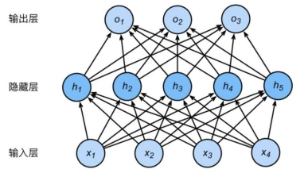
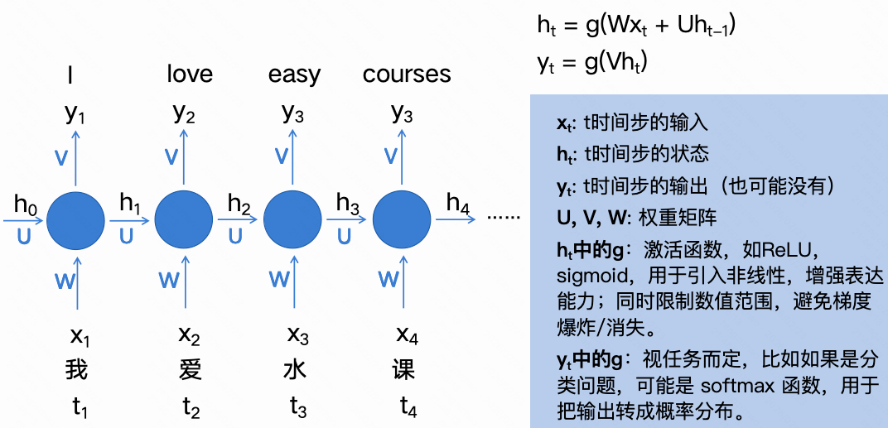
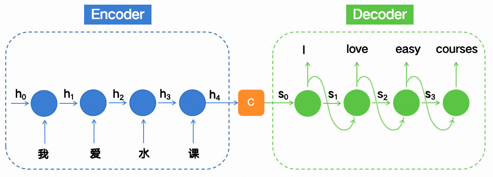
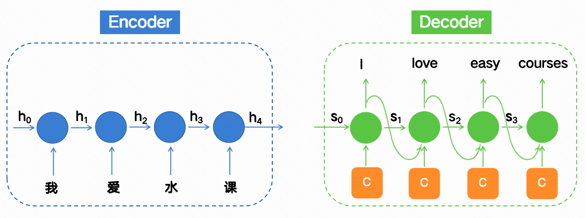
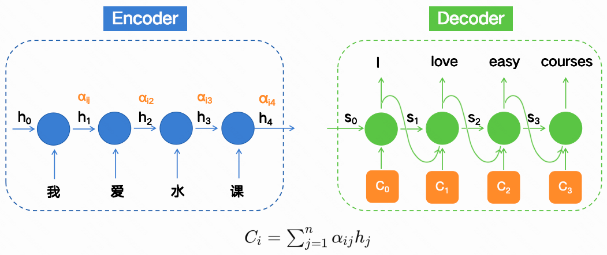
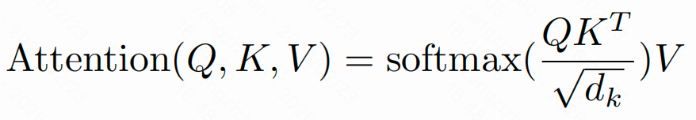
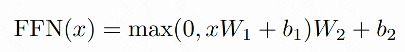

# 导言

之前序列转导模型基于RNN/CNN、使用编码器、解码器结构、使用注意力机制增强。RNN（包括LSTM、GRU）在序列建模和转导问题表现最好。但是RNN任然存在不足：顺序计算阻碍了并行训练；无法捕捉长期依赖。注意力机制能够捕捉序列中任意位置的依赖关系，但通常与RNN结合使用

提出了全新的简单网络架构Transformer，完全抛弃RNN/CNN，仍然使用编码器、解码器结构，完全基于注意力机制来捕捉输入和输出之间全局依赖关系的模型架构，且支持并行

> **序列转导模型：**输入一个序列，输出一个序列。例如机器翻译   

## 为什么不适合序列转导任务？

### 前馈神经网络FFN

如果用其处理序列转导任务步骤如下：

**输入：**水是有毒的

**步骤1：分词**

[水，是，有毒，的]

**步骤2：embedding向量化**

水——>[0.2, -0.1,  0.3, 0.0]

是——>[0.0,  0.5, -0.2, 0.1]

有毒——>[0.9, -0.3,  0.4, 0.2]

的——>[0.1,  0.0,  0.0, 0.1]

**步骤3：合并词向量（平均或拼接）**

平均成一个4维向量，每个维度为每个向量的均值，但是这样完全丢掉了词语的顺序

将4个4维向量拼接为1个16维向量，但是存在如下问题1.需要固定维度的输入，对不同长度的句子处理效率低下；2.仍然会将句子视作一个整体来处理，无法理解真正的“谁先谁后”的关系

### 循环神经网络RNN

解决的问题：

能够建模词序：RNN 是按时间顺序（token 顺序）逐个处理输入的；

能够建模上下文依赖：RNN 是逐个喂入词语，并且会有“记忆”机制；

支持不定长输入：不再需要 FNN 那种固定长度的输入格式，句子多长都行；

存在的问题：

不适合输入输出不等长的情况，即输入我爱水课，输出不是4个词

顺序计算阻碍了并行训练

无法捕捉长期依赖

### 编码器-解码器结构

解决的问题：支持输入输出不等长

**解码方式1**

C是上下文向量，是对整个输入序列的语义编码，等于最后一个时间步的隐藏状态输出h4

**解码方式2**

编码部分不变，只是在解码的每一个时间步都加上C

存在的问题：

模型处理长序列时的”遗忘“问题：上下文向量C关于最前面的我、爱的信息被稀释遗忘

不同时间步输入对当前时刻输出的“重要性”问题：解码方式2中上下文向量C对每个解码器生成的token影响都是一样的

### 注意力机制

解决的问题：

解决模型处理长序列时的“遗忘”问题：随着序列长度的增长，远距离依赖信息在传递过程中易被稀释，导致模型对长距离依赖关系的建模能力减弱。

解决不同时间步输入对当前时刻输出的“重要性”问题：所有时间步的输入在计算当前时刻输出时被同等对待，忽略了不同时间步对当前时刻输出的重要性可能存在的差异。

由编码器-解码器结构中的解码方式2衍生出，给解码器每个时间步输入的上下文信息Ci关注的是不同的上下文信息，如下所示

# 背景

**已有工作**

使用CNN为所有输入和输出位置并行计算隐藏表示，减少顺序计算。但是使得长期依赖学习变得困难

自注意力（Self-attention/内部注意力intra-attention），是一种关联单个序列不同位置以计算该序列表示的注意力机制。

端到端记忆网络（End-to-end memory networks）基于循环注意力机制而非序列对齐的循环结构，在简单语言问答和语言建模任务中表现良好。

**我们的工作**

Transformer 是第一个完全依赖自注意力来计算其输入和输出表示，而不使用RNN 或 CNN 的转导模型。

# 模型架构

Transformer 遵循编码器-解码器结构，在编码器和解码器中均使用了堆叠的自注意力层和逐位置全连接层

> 编码器-解码器结构：编码器将符号表示的输入序列 (x1,…,xn) 映射为一个连续表示序列 z=(z1,…,zn) 。根据 z 解码器生成符号的输出序列 (y1,…,ym)，且每次生成一个元素。在每一步中，模型都是自回归的，即在生成下一个符号时，会将之前生成的符号作为额外的输入。

## 编码器和解码器架构

**编码器**
编码器由N=6个完全相同的层堆叠而成。每层包含两个子层：第一层是多头自注意力机制，第二层是逐位置全连接层。我们在每个子层都用了残差连接，随后层归一化。

每个子层的输出为LayerNorm(x+Sublayer(x))，其Sublayer(x)是子层本身实现的函数。

为了便于实现这些残差连接，模型中的所有子层以及嵌入层产生的输出维度均为512维

**解码器：**
解码器由N=6个完全相同的层堆叠而成。除了每个编码器层中的两个子层外，解码器有第三个子层，该子层对编码器的输出执行多头注意力。与编码器类似，我们在每个子层用残差连接，随后层归一化。我们还修改了解码器中的自注意力子层，使用掩码处理，确保确保每个生成的词只能依赖之前的词，而不是未来的词

## 注意力

注意力函数可以描述为将一个查询query和一组键值对key-value pairs映射为一个输出的过程，其中查询、键、值以及输出均为向量。输出是通过对值values进行加权求和得到的，而分配给每个值的权重则是通过查询与键的相关性函数计算得出的。

### 缩放点积注意力

输入为维度为dk的查询和键、维度为dv的值。计算查询与所有键的点积，将每个点积除以根号下dk，然后应用softmax函数以获得作用在值上的权重。

1.输入：维度为 dk 的 query（查询向量） 和 key（键向量），维度为dv的 value（值向量）。

2.计算相似度（点积）矩阵： QK的转置

3.进行缩放：点积除以根号下dk

4.应用 softmax 得到权重

5.对 value 进行加权平均：乘 V

6.得到注意力输出

> **为什么使用点积注意力？**
>
> 最常用的注意力是加法注意力、点积注意力，点积注意力与我们的算法几乎相同，唯一区别是我们添加了缩放因子。选用点积注意力，是因为它计算更快也更省内存。
>
> **为什么要使用缩放因子？**
>
> 在dk小时两种机制的表现一致，对于大的dk，加法注意力优于点积注意力。因为大的dk使得点积的数值量级变得很大，从而将 softmax 函数推向梯度极小的区域。为了抵消这一影响，我们通过除以根号下dk来对点积进行缩放。

### 多头注意力

使用dmodel维（每个token的嵌入向量维度）=512的键、值和查询执行单个注意力函数，不如将查询、键和值分别通过h=8次线性投影，投影dk=dv=dmodel/h=64维，这样做更有益。在这些投影后的查询、键和值上，我们并行地执行注意力函数，产生dv维的输出值。将这些输出拼接起来并再次投影，得到最终输出。

多头注意力机制让模型并行地从多个不同的表示角度（子空间）和多个位置去提取信息，从而获得更丰富更细致的理解。单头注意力由于存在平均化操作，这种能力会受到抑制。

**Transformer模型中多头注意力的三种应用：**

**编码器-解码器注意力层**中，查询Q来自前一个解码器层，而键K和值V则来自编码器的输出。这使得解码器中的每一个位置都能关注到输入序列中的所有位置。

**编码器包含自注意力层**，在自注意力层中，所有的键、值和查询都来自同一个，即编码器前一层的输出。编码器中的每个位置都可以关注到编码器前一层的所有位置。

**解码器中的自注意力层**，允许解码器中的每个位置关注到该位置及其之前的所有位置。在缩放点积注意力内部通过掩盖来实现。

## 全连接神经网络

由两个线性变换组成，中间夹着一个 ReLU 激活函数，通过非线性变换学习更复杂的特征

## 嵌入层与Softmax

嵌入层：将输入的token转换为向量

线性层、Softmax：将解码器输出转换为模型预测的下一个token的概率

## 位置编码

由于 Transformer 没有RNN、CNN，无法自然地处理输入token的顺序信息，因此需要在输入嵌入向量上添加位置编码，让模型理解序列的顺序。具体而言，是使用了不同频率的正弦和余弦函数实现位置编码

# 为什么用自注意力

比较了三种不同的网络结构（Self-Attention、RNN、CNN），从三个关键因素分析为什么选择Self-Attention（第一点：每层的总计算复杂度；第二点：并行计算能力；第三点：模型内部学习长距离依赖的能力）

额外好处：Self-Attention 更容易解释，可以直接看 Attention 权重矩阵，看每个词关注了哪些词，来理解模型在思考什么。多个注意力头可以各司其职

